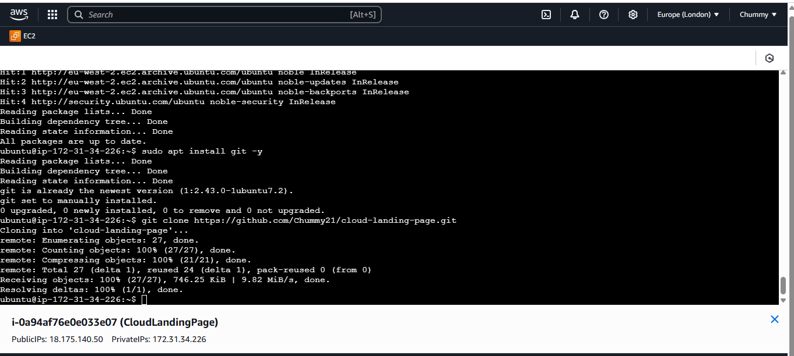

# The Future of AI-Powered Trading Technology

### NAME: Chioma Okafor
### ALTSCHOOL ID:ALT/SOE/024/4939

---

# 🌥️ 
## 📌 Project Description

This project showcases a responsive cloud-themed landing page, deployed on an AWS EC2 instance with Nginx as the web server. It was developed as part of my 
AltSchool Africa Tinyuka Second Semester coursework, where I explored the core principles of Linux server provisioning, static site deployment, and web server 
configuration in a real-world cloud environment.

## 🔗 Live Demo

- **Public IP**: [http:/18.175.140.50](http://18.175.140.50)  
- **Secure HTTPS**: [https://chummy7.strangled.net](https://chummy7.strangled.net)

---

## 🗂️ Project Structure

ai-cloud-landing-page/
├── index.html
├── style.css
├── README.md

## 📌 Features

- Responsive HTML/CSS landing page
- Tailwind CSS for styling via CDN
- Hosted on AWS EC2 Ubuntu server
- Nginx web server for deployment
- Git + GitHub for version control
- FreeDNS subdomain mapping (optional)
- SSL via Let’s Encrypt (Certbot)

## 🚀 Steps Taken to complete the project

### 1. 🖊️ Created the Web Page
- Built a basic HTML + CSS landing page
- Added Tailwind CSS via CDN to enhance styling and responsiveness

### 2. **EC2 Instance Setup**  
   Launched an EC2 instance on Ubuntu 24.04, enabling HTTP and HTTPS.  
   Screenshots:  
     

   - EC2 Instance Created
   
   
### 3. **Connecting to EC2 and Installing Nginx**  
   Accessed the instance via SSH and installed Nginx.  
   - **Before Nginx Installation**:  
       
   - **After Nginx Installation**:  
     

### 4. Cloned the GitHub Repo on EC2 Using:
 - git clone https://github.com/Chummy21/cloud-landing-page.git
 - 

### 5. **Deploying the Web Page**  
   Replaced the default Nginx HTML file with my custom HTML file.  
   

   
### 6. **Subdomain Creation with FreeDNS**  
   Created a subdomain using FreeDNS.  
   

### 7. 🌍 Connected a Subdomain (Optional)
 - Registered a subdomain on FreeDNS
 - Pointed it to my EC2 Public IP
 - verified using ping and browser

### 8. 🛡️ Secured with SSL (Optional)
 - Used Certbot to install Let's Encrypt SSL (only if the domain was active):
  - sudo apt install certbot python3-certbot-nginx -y
  - sudo certbot --nginx

### 9. 🎨 Tailwind CSS
 - Tailwind was added using CDN in index.html:
  - 
   - I also Used utility classes like:
     - <div class="bg-blue-500 text-white text-center p-4"

